# CTF Coach


Plataforma para aprender ciberseguridad con salas guiadas, retos tipo CTF, un tutor que da pistas progresivas sin revelar la solución, roadmap, cuentas y clasificación.

**Todo funciona en local**: no usa ningún servicio externo ni necesita claves de API.

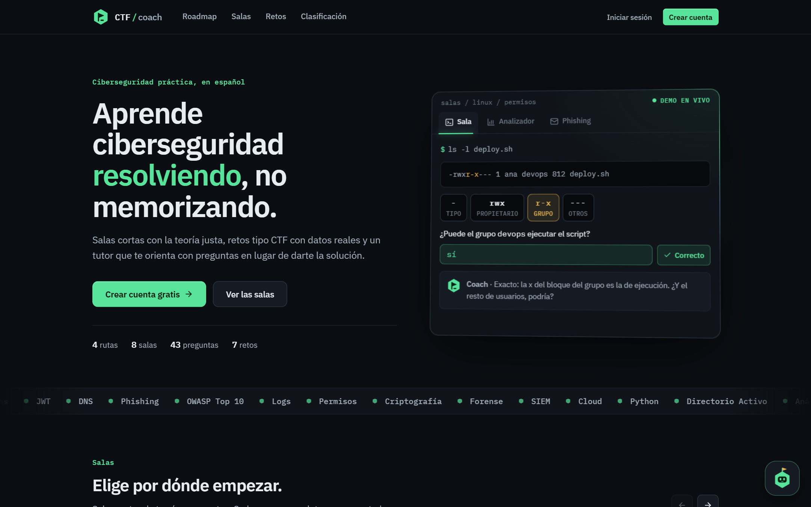

## Capturas

La portada incluye una demo interactiva con tres pestañas que muestran cómo se aprende en la plataforma:

| Sala | Analizador | Phishing |
|:---:|:---:|:---:|
| 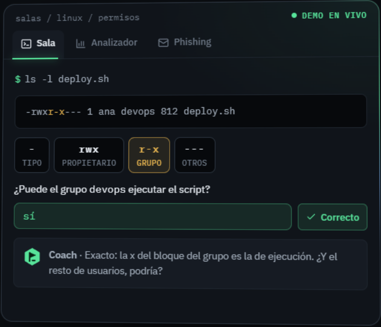 | 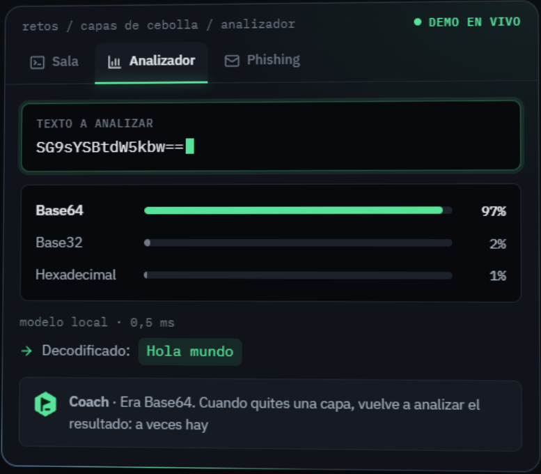 | 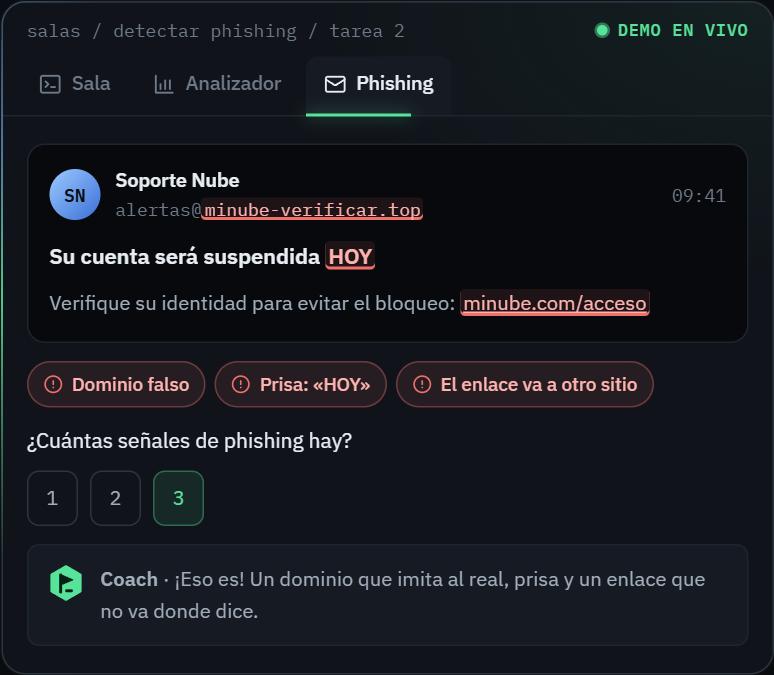 |
| Lees los permisos de un archivo y el Coach te guía con preguntas. | El modelo local identifica la codificación mientras escribes. | Señalas las pistas de un correo fraudulento. |

### Salas

Rutas de aprendizaje con teoría corta y preguntas. Mientras respondes, el Coach te orienta hacia la parte de la teoría que necesitas, sin darte la respuesta.

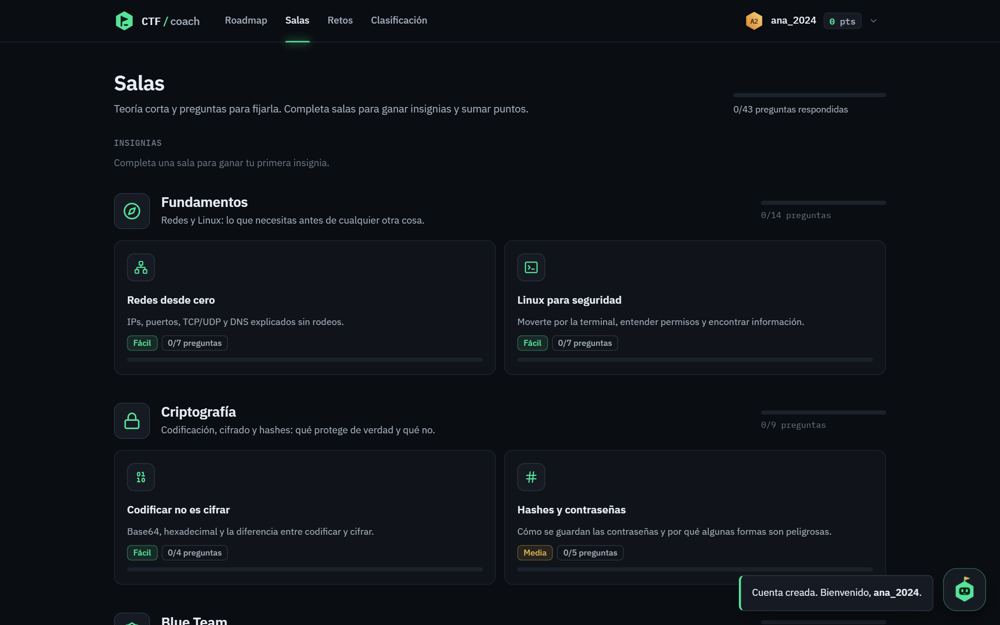

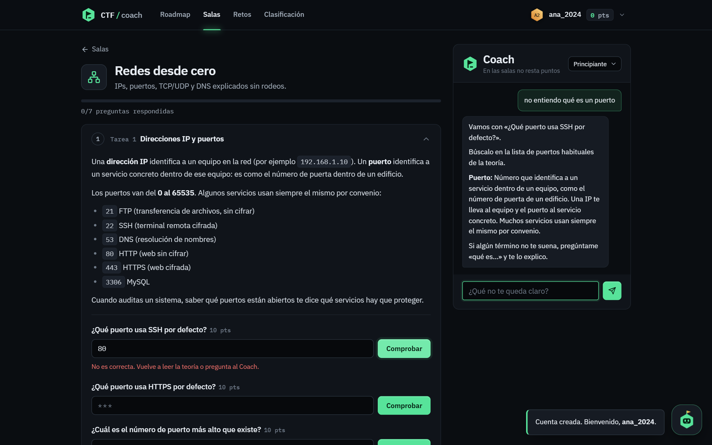

### Retos

Retos tipo CTF oficiales y un generador que crea retos nuevos a partir de cualquier tema.

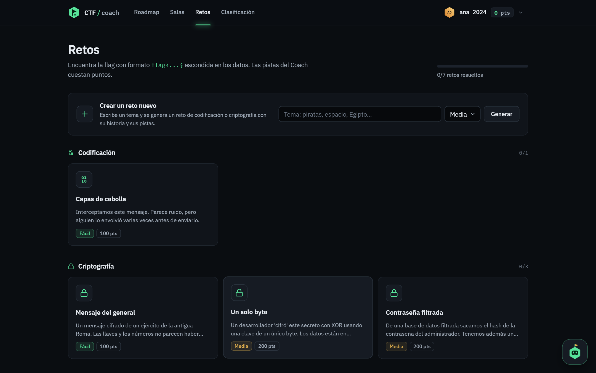

Dentro de un reto tienes los datos, el analizador local (gratis) y las pistas del Coach en tres niveles, cada uno con su penalización:

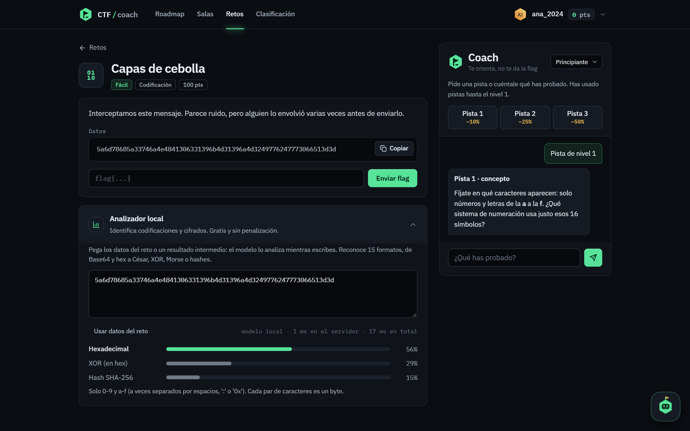

### Roadmap

Ruta completa de ciberseguridad en 5 etapas. Los temas que se practican aquí muestran tu progreso; el resto enlaza a recursos externos.

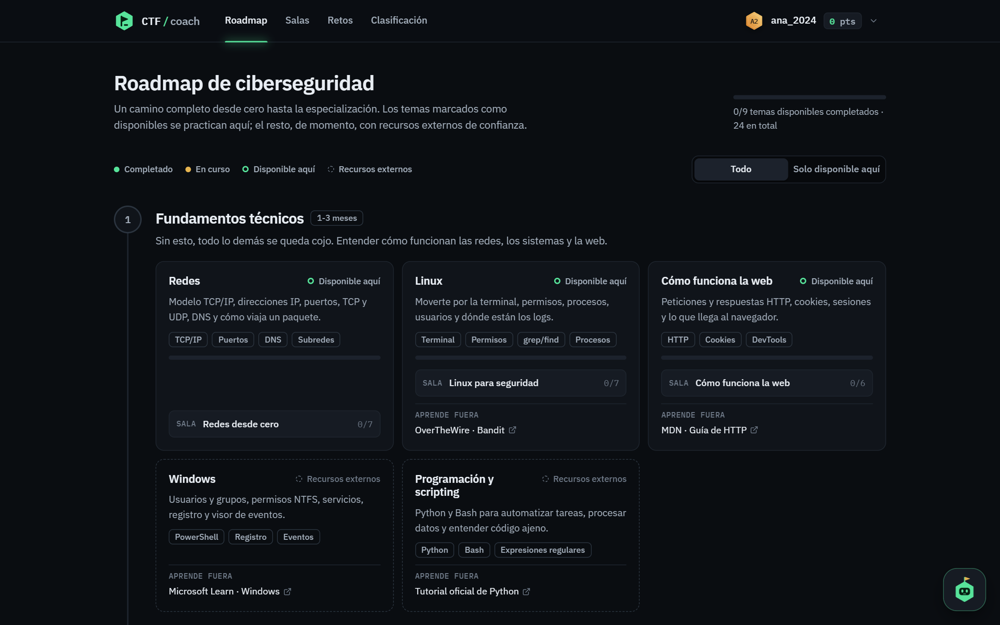

### Cuentas y clasificación

<table>
  <tr>
    <td width="50%">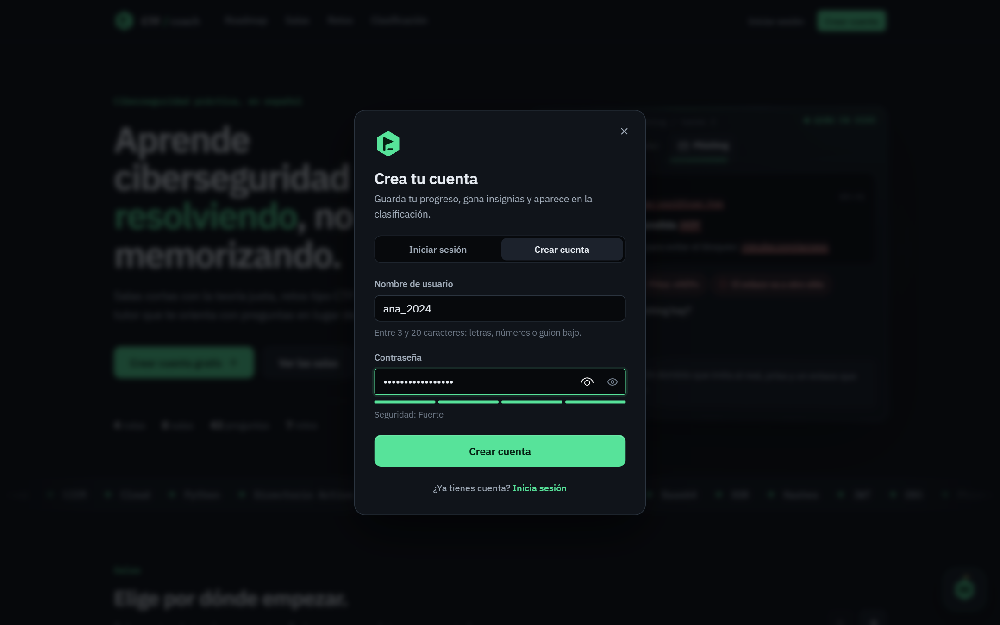</td>
    <td width="50%">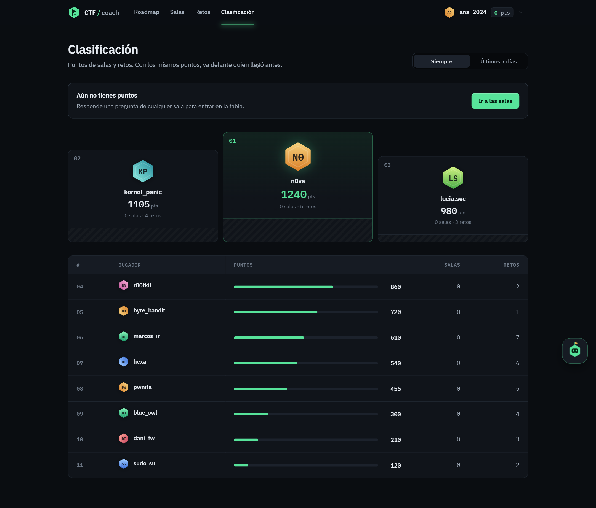</td>
  </tr>
  <tr>
    <td align="center">Registro con medidor de seguridad de la contraseña.</td>
    <td align="center">Podio, tabla y filtro de la última semana.</td>
  </tr>
</table>

## Puesta en marcha

```bash
python -m venv .venv
.venv/Scripts/pip install -r requirements.txt      # en Linux/Mac: .venv/bin/pip
.venv/Scripts/python -m ml.train                   # entrena el analizador local (~20 s)
.venv/Scripts/uvicorn app.main:app --reload
```

Abre http://localhost:8000

### Con Docker

```bash
docker build -t ctf-coach .
docker run -p 127.0.0.1:8000:8000 -v ctf-data:/data ctf-coach
```

### Desplegar en la nube

[](https://render.com/deploy?repo=https://github.com/Zer0Dev-exe/CTF-Coach)

- **Render:** `render.yaml` crea el servicio a partir del `Dockerfile`, con un disco de 1 GB en `/data` para la base de datos (requiere el plan Starter, porque el gratuito no tiene discos).
- **Railway:** *New Project → Deploy from GitHub repo*. `railway.json` usa el `Dockerfile`. Añade un volumen montado en `/data` y la variable `COOKIE_SECURE=1`.

La base de datos es SQLite, así que necesita un disco persistente. Por eso no sirven plataformas serverless como Vercel.

### Pruebas

```bash
.venv/Scripts/pip install -r requirements-dev.txt
.venv/Scripts/python -m pytest
```

Entre otras cosas, comprueban que el Coach nunca revela una respuesta ni una flag, sea cual sea el mensaje.

## Cómo funciona

| Pieza | Archivo | Qué hace |
|---|---|---|
| Roadmap | `app/roadmap.py` | Ruta general de ciberseguridad en 5 etapas y 24 temas. Los temas con salas o retos enlazados muestran el progreso del usuario; el resto apunta a recursos externos. Para añadir un tema, usa `topic(...)` en `ROADMAP`. |
| Salas (estilo THM) | `tools/build_rooms.py` → `app/rooms.json`, `app/rooms.py` | 4 rutas de aprendizaje (Fundamentos, Criptografía, Blue Team, Web) con 8 salas. Cada sala tiene tareas con teoría y preguntas de texto u opción múltiple. Solo se guarda el SHA-256 de cada respuesta normalizada (sin mayúsculas, tildes ni espacios sobrantes). Completar una sala o una ruta da insignias. Enlace directo: `/#sala/<id>`. |
| Retos oficiales | `tools/build_challenges.py` → `app/challenges.json` | Se generan con `python tools/build_challenges.py`. El JSON solo guarda el SHA-256 de cada flag. |
| Coach | `app/coach.py` | Tutor por reglas. En los retos da tres niveles de pista escritos a mano (concepto → técnica → pasos); en las salas señala la nota o la parte de la teoría de la pregunta pendiente sin citarla. Explica conceptos con un glosario y analiza lo que le pegues con el modelo local. Un filtro final quita cualquier frase que contenga una respuesta: compara hashes de cada fragmento de 1 a 6 palabras, así que el servidor no necesita conocer las respuestas en claro. |
| Bit (mascota) | `app/assistant.py`, `POST /api/assistant` | Chat flotante abajo a la derecha en todas las páginas. Conoce la web entera: te lleva a cualquier sala, reto o tema del roadmap, te dice dónde está cada función y la resalta en pantalla, responde dudas (puntos, pistas, flags, cuentas...), explica conceptos y te recomienda qué hacer según tu progreso. Funciona por reglas; para añadir algo, edita `FEATURES`, `FAQ` o los alias. Las pruebas comprueban que entiende todas sus propias sugerencias y que cada enlace apunta a algo que existe. |
| Retos generados | `app/generator.py` | Procedural: a partir del tema elige una cadena de transformaciones según la dificultad (Base64, César, XOR...), monta una historia con pistas sutiles sobre cada capa, crea una flag aleatoria, comprueba que se puede resolver y genera sus tres pistas. |
| Cuentas y puntos | `app/auth.py`, `app/db.py` | Contraseñas con scrypt, sesiones en cookie HttpOnly, progreso y chat en SQLite (`data/ctf.db`). |
| Clasificación | `GET /api/leaderboard?period=all\|week` | Podio, tu posición y distancia al siguiente; en caso de empate gana quien llegó antes. |
| Analizador local | `ml/` | Modelo propio (Random Forest) que identifica 15 codificaciones y cifrados en ~0,5 ms. |

### El modelo local

```bash
.venv/Scripts/python -m ml.train
```

Genera 37.500 textos sintéticos con las mismas transformaciones que usan los retos y las variantes que se ven en la práctica (hex en mayúsculas o con separadores, Base64 de URL sin relleno, textos muy cortos, inglés...). Entrena un Random Forest en unos 20 segundos y guarda `ml/model.joblib` y dos gráficas de matplotlib en `ml/reports/`: la matriz de confusión y la importancia de cada característica. Con el conjunto de prueba acierta el 98,6 %.

<table>
  <tr>
    <td width="55%">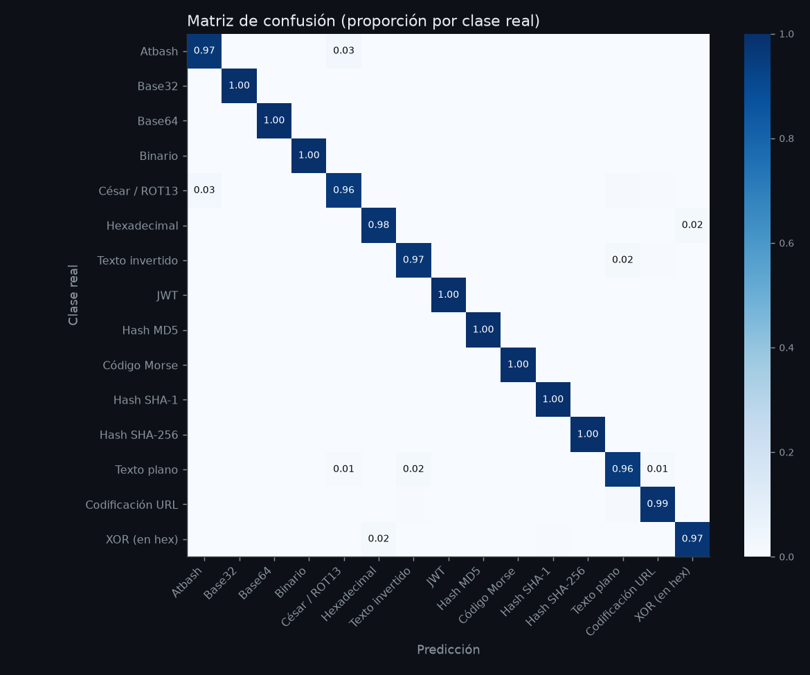</td>
    <td width="45%">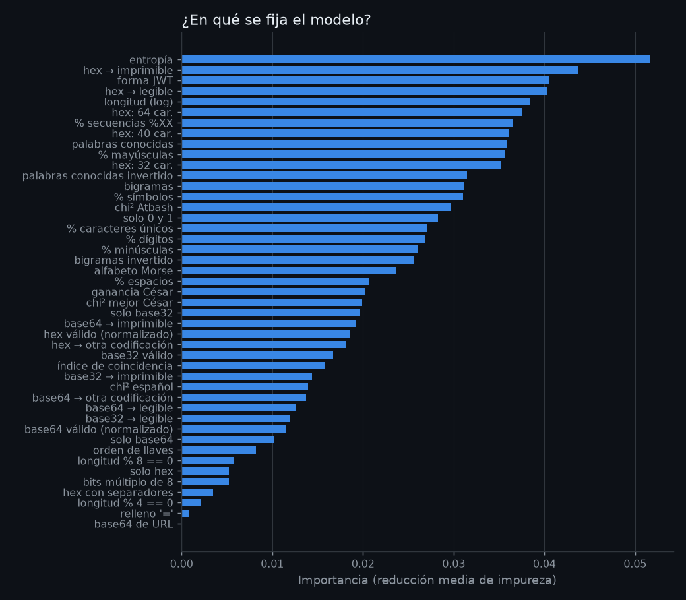</td>
  </tr>
</table>

Clases (15): texto plano, Base64, Base32, hexadecimal, César/ROT13, Atbash, texto invertido, XOR (en hex), MD5, SHA-1, SHA-256, JWT, binario, codificación URL y Morse. Se fija en 45 características (`ml/features.py`): juego de caracteres, entropía, índice de coincidencia, chi² frente al español (probando los 26 desplazamientos de César y Atbash), bigramas, palabras conocidas al derecho y al revés y, tras normalizar la entrada, **qué sale al decodificarla** como hex, Base64 o Base32 (legible, otra capa de codificación o bytes sin sentido).

**Velocidad.** El servidor no usa scikit-learn: `ml/fastforest.py` aplana los 150 árboles en arrays de numpy y los recorre todos a la vez, nivel a nivel. El entrenamiento comprueba que da exactamente las mismas probabilidades que scikit-learn. Un análisis completo tarda ~0,5 ms (antes ~80 ms), así que la web analiza mientras escribes.

```bash
.venv/Scripts/python -m ml.benchmark   # precisión con 43 casos escritos a mano y tiempos
```

**Puntuación:** cada pista resta puntos del reto según el nivel más alto pedido antes de resolverlo: nivel 1 −10%, nivel 2 −25%, nivel 3 −50%. Las pistas pedidas después de resolverlo no penalizan.

**Límites** (en `app/main.py`): 200 mensajes al Coach por hora y 20 retos generados al día por usuario.

## Añadir una sala

Añade la sala dentro de la ruta que corresponda en `PATHS` (`tools/build_rooms.py`). Cada tarea lleva `title`, `content` (Markdown sencillo: listas, `código`, **negrita** y bloques ```), `data` opcional y `questions` creadas con `q(pregunta, respuesta_o_lista, points=10, notes="", options=None)`. Después ejecuta `python tools/build_rooms.py`. El script falla si una respuesta aparece en las notas del Coach.

Las salas no penalizan por usar el Coach. Los puntos de las salas suman a la clasificación junto con los de los retos.

## Añadir un reto oficial

Añade un bloque en `build()` dentro de `tools/build_challenges.py` con `id`, `title`, `category`, `difficulty`, `points`, `description`, `data`, `tutor_notes` y `flag`, y vuelve a ejecutar el script. Falla si la solución aparece en `tutor_notes`.
